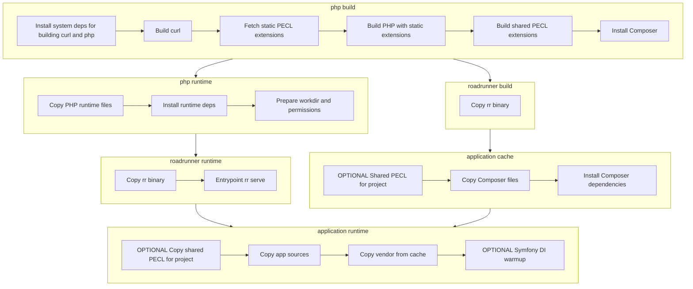

# RoadRunner docker

Basic images for PHP projects using RoadRunner.

Based on official cli version of [php](https://hub.docker.com/_/php) and [roadrunner](https://docs.roadrunner.dev/docs/app-server/docker).

Differences between the php image and the official image:

- Disabled phpdbg;
- Disabled SQLite support;
- Added MySQL and PDO MySQL support;
- Added PostgreSQL and PDO PostgreSQL support;
- Added Composer;
- Added fresh cURL with [async DNS resolver](https://curl.se/mail/archive-2019-07/0003.html);
- Added the following extensions when compiling PHP (statically):
  - ds - [Data Structures](https://www.php.net/manual/en/book.ds.php), [pecl](https://pecl.php.net/package/ds)
  - igbinary - [roadrunner](https://docs.roadrunner.dev/docs/key-value/overview-kv#igbinary-value-serialization), [pecl](https://pecl.php.net/package/igbinary)
  - protobuf - [roadrunner](https://docs.roadrunner.dev/docs/key-value/overview-kv#php-client), [pecl](https://pecl.php.net/package/protobuf)
  - sodium - [roadrunner](https://docs.roadrunner.dev/docs/key-value/overview-kv#end-to-end-value-encryption)
  - amqp - [pecl](https://pecl.php.net/package/amqp)
  - memcached - [pecl](https://pecl.php.net/package/memcached)
  - redis - [pecl](https://pecl.php.net/package/redis)
  - yaml - [pecl](https://pecl.php.net/package/yaml)
- Added the following extensions (dynamically) and can be enabled:
  - event - [pecl](https://pecl.php.net/package/event)
  - excimer - [pecl](https://pecl.php.net/package/excimer)
  - xdebug - [pecl](https://pecl.php.net/package/yaml)

<details>
<summary>Full list of modules:</summary>

```text
[PHP Modules]
amqp
bcmath
Core
ctype
curl
date
dom
ds
fileinfo
filter
hash
iconv
igbinary
imap
intl
json
libxml
mbstring
memcached
mysqli
mysqlnd
openssl
pcntl
pcre
PDO
pdo_mysql
pdo_pgsql
pgsql
Phar
posix
protobuf
random
readline
redis
Reflection
session
SimpleXML
sockets
sodium
SPL
standard
tokenizer
xml
xmlreader
xmlwriter
yaml
Zend OPcache
zip
zlib

[Zend Modules]
Zend OPcache
```

</details>

## Usage

These images are intended to be used as dedicated builder/runtime base images in multi-stage Dockerfiles. The `example/` directory demonstrates this pattern:

- **Builder stage**: use `ghcr.io/roqmeu/rr2025-bookworm-build:latest` (PHP + rr + build libs + PECL + Composer) to install dependencies.
- **Runtime stage**: use `ghcr.io/roqmeu/rr2025-bookworm-runtime:latest` (PHP + rr + runtime libs). Copy only `vendor/` and application sources; no additional install steps are required.

### Typical multi-stage Dockerfile

```Dockerfile
# 1) Builder: PHP + Composer (+ rr in base)
FROM ghcr.io/roqmeu/rr2025-bookworm-build:latest AS cache

COPY composer.json /var/www/html/
RUN composer update -o -a -n --no-cache --no-progress

# 2) Runtime: minimal image with PHP + rr and runtime deps
FROM ghcr.io/roqmeu/rr2025-bookworm-runtime:latest AS app

COPY --chown=www-data:www-data --chmod=700 --from=cache /var/www/html/vendor /var/www/html/vendor
COPY --chown=www-data:www-data --chmod=700 . /var/www/html/
```

### Build process diagram



### Build and run the example

```bash
docker build -t rr-example --target app ./example
docker run --rm -p 8080:8080 rr-example
# Test: curl http://localhost:8080  ->  Hello RoadRunner!
```

Optional: build base images locally instead of pulling from GHCR:

```bash
make build_php && make build_rr
docker build -t rr-example --target app ./example
```
